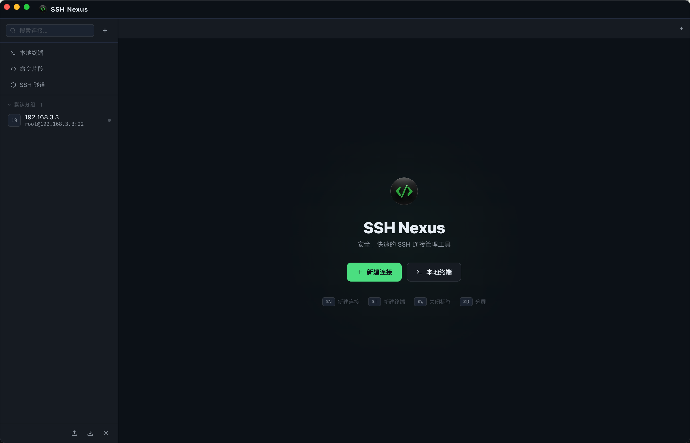

# SSH Nexus

一个现代化的 SSH 连接管理工具，基于 Electron + xterm.js 构建。

---



## 技术架构

```
SSH Nexus (Electron)
    └── xterm.js          ← 终端 UI 渲染
    └── node-pty          ← 伪终端 (PTY)，处理本地 Shell
    └── ssh2              ← SSH 协议实现，处理远程连接
    └── electron-store    ← 本地配置持久化存储
```

## 功能特性

- **SSH 连接管理** — 新建、编辑、删除、复制连接配置，支持导入/导出
- **分组管理** — 将连接按环境分组（生产/测试/开发）
- **多标签终端** — 同时打开多个 SSH 会话和本地终端
- **终端分屏** — 支持左右/上下分屏，同时操作多个终端
- **认证方式** — 支持密码认证和 SSH 私钥认证
- **跳板机支持** — 通过跳板机连接内网服务器
- **连通性测试** — 保存前验证连接是否可用
- **本地终端** — 内置本地 Shell 终端
- **保持活动** — 默认300秒保持活动连接
- **搜索过滤** — 快速搜索连接列表
- **命令片段** — 保存常用命令片段，一键发送到终端
- **SSH 隧道** — 端口转发（本地/动态 SOCKS5 代理）
- **SFTP 文件管理** — 远程文件浏览、上传、下载、删除、新建目录
- **自动重连** — 断线后自动重连（可配置次数与间隔）
- **多主题** — 6 种内置主题（深色/极深/浅色/Nord/Solarized/Dracula）
- **日志记录** — 会话日志本地持久化（可开关）

## 快速开始

### 环境要求

- Node.js >= 18
- npm >= 8
- macOS / Linux / Windows

### 安装依赖

```bash
# macOS / Linux
chmod +x install.sh && ./install.sh

# 或手动安装
npm install
```

**构建工具（编译 node-pty 需要）：**

```bash
# macOS
xcode-select --install

# Ubuntu / Debian
sudo apt-get install python3 make g++

# Windows
npm install -g windows-build-tools
```

### 启动应用

```bash
npm start          # 正常启动
npm run dev        # 开发模式（带 DevTools）
```

---

## 项目结构

```
ssh-nexus/
├── package.json
├── install.sh
├── src/
│   ├── main/
│   │   ├── main.js          ← Electron 主进程
│   │   └── preload.js       ← 安全桥接层 (contextBridge)
│   └── renderer/
│       ├── index.html       ← 应用入口 HTML
│       ├── app.js           ← 渲染进程逻辑
│       └── styles/
│           └── app.css      ← 全局样式
├── resources/               ← 应用图标
└── dist/                    ← 构建产物
```

### 打包发布

```bash
npm run build:mac      # macOS DMG
npm run build:win      # Windows 安装包
npm run build:linux    # Linux 安装包
```

**macOS 安全提示**：若提示“包含恶意软件”，运行以下命令进行 ad-hoc 签名：
```
# 清理旧的构建产物
rm -rf dist/

# 重新打包（这会生成全新的 .app）
npm run build  # 或者你用的打包命令，比如 npm run dist

# 进入新生成的目录
cd dist/mac/

#这个命令会告诉你应用是否被正确签名，以及签名里包含了哪些关键信息。
codesign -dv --verbose=4 "SSH Nexus.app"
#这个命令模拟了 macOS 在你打开应用时进行的检查，它会直接告诉我们系统为什么拒绝。
spctl --assess --verbose=4 --type execute "SSH Nexus.app"

# 我们需要启用“任何来源”：
sudo spctl --master-disable

# 移除隔离属性
sudo xattr -cr "SSH Nexus.app"

# 再次执行 ad-hoc 签名
codesign --force --deep --sign - "SSH Nexus.app"

# 验证签名状态（应该看到 Source=Unavailable 或 ad-hoc）
codesign -dv "SSH Nexus.app"
```

---

## 使用说明

### 新建 SSH 连接

1. 点击侧边栏 **+** 按钮，或使用快捷键 `Ctrl+N`
2. 填写连接名称、主机地址、用户名
3. 选择认证方式（密码 / 私钥）
4. 可选：配置跳板机
5. 点击「测试连接」验证，然后保存

### 连接到服务器

- **双击**侧边栏中的连接项，即可开启新标签连接

### 终端分屏

- 点击终端工具栏的 **左右分屏** / **上下分屏** 按钮
- 或右键终端区域选择分屏方向
- 快捷键 `Ctrl+D`

### 命令片段

- 点击侧边栏 **命令片段** 按钮管理片段
- 在终端工具栏点击 **发送命令片段**，搜索并一键发送
- 支持多行命令

### SSH 隧道

- 点击侧边栏 **SSH 隧道** 配置端口转发
- 支持本地转发（Local）和 SOCKS5 动态代理

### SFTP 文件管理

- 右键连接项 → **打开 SFTP**
- 双击目录进入，支持上传、下载、新建目录、删除

### 右键菜单

右键点击连接项，可以：
- 连接 / 编辑 / 复制 / 删除 / 打开 SFTP / 分屏连接

### 快捷键

| 快捷键 | 功能 |
|--------|------|
| `Ctrl+N` | 新建连接 |
| `Ctrl+T` | 新建本地终端 |
| `Ctrl+D` | 左右分屏 |
| `Ctrl+W` | 关闭当前标签 |
| `Esc` | 关闭弹窗 |

---
